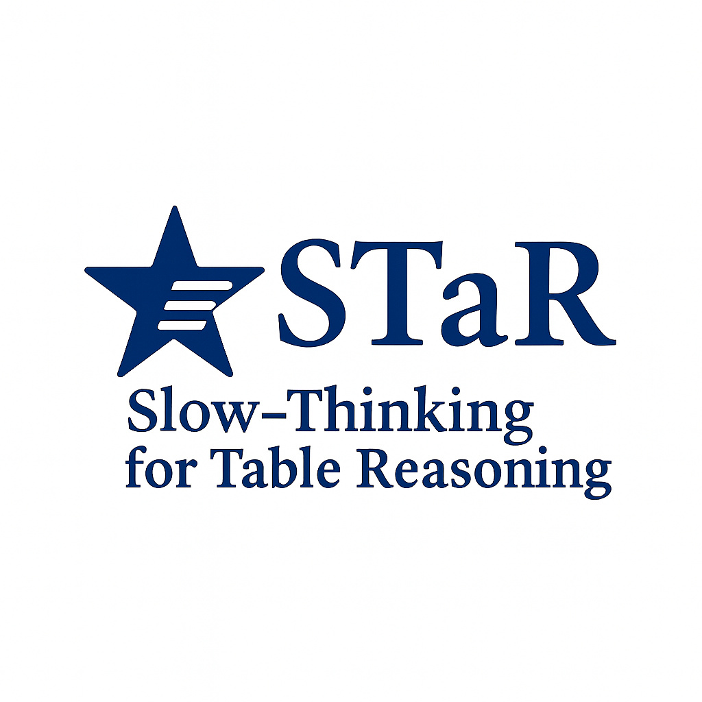
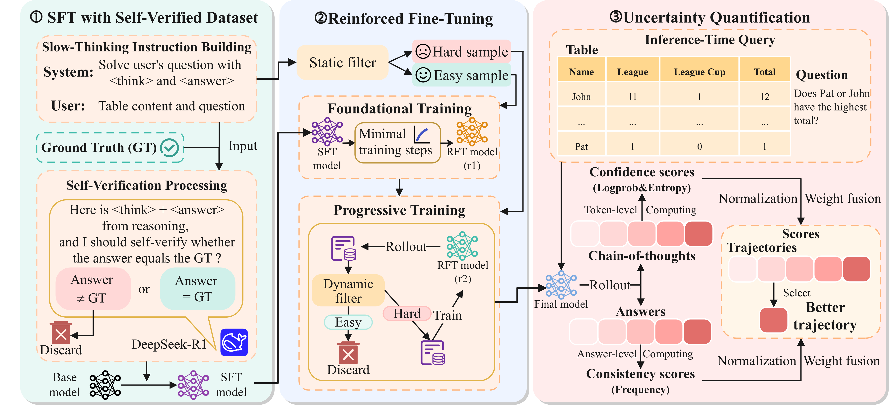

[English](readme.md) | [中文](readme_cn.md)

<div align="center">



# ⭐ STaR: Towards Effective and Stable Table Reasoning via Slow-Thinking Large Language Models

[](https://arxiv.org/abs/2511.11233)
[](https://huggingface.co/datasets/zhjai/STaR-Datasets)
[](LICENSE)

**一种用于有效且稳定表格推理的慢思考模型**

[📄 论文](https://arxiv.org/abs/2511.11233) • [🤗 数据集](https://huggingface.co/datasets/zhjai/STaR-Datasets) • [🏠 GitHub](https://github.com/zhjai/STaR)

</div>

---

## 📌 概述

<div align="center">

</div>

**STaR**（Slow-Thinking Table Reasoning，慢思考表格推理）是一种新颖的慢思考模型，能够实现有效且稳定的表格推理。它通过两阶段训练框架（SFT + RFT）实现有效的多步推理，并通过轨迹级不确定性量化提高推理稳定性。

### ✨ 核心特性

- 🧠 **有效的多步推理**：两阶段训练框架，包含 SFT 预热和强化微调（RFT）
- 📈 **难度感知强化学习**：渐进式处理复杂推理的强化学习机制
- 🎯 **稳定推理**：融合 token 级置信度和答案一致性的轨迹级不确定性量化
- 🚀 **强泛化能力**：领域内最先进性能，领域外优秀泛化表现

---

## 📋 摘要

Table reasoning with large language models (LLMs) plays a critical role in building intelligent systems capable of understanding and analyzing tabular data. Despite recent progress, existing methods still face key limitations: their reasoning processes lacks depth and explicit multi-step reasoning, often relying solely on implicit language model understanding. In addition, their reasoning processes suffer from instability, primarily caused by model uncertainty.

In this work, we propose **STaR**, a novel slow-thinking model that can achieve effective and stable table reasoning. To enable effective multi-step reasoning, we design a **two-stage training framework** consisting of supervised fine-tuning (SFT) warm-up followed by reinforced fine-tuning (RFT). Specifically, in the SFT stage, we construct a high-quality dataset through automatic self-verification. In the RFT stage, we introduce a **difficulty-aware reinforcement learning mechanism** to further enhance reasoning capabilities. Furthermore, to improve reasoning stability, we introduce **trajectory-level uncertainty quantification**, which fuses token-level confidence with answer-level consistency, enabling the selection of better reasoning trajectories. Extensive experiments demonstrate that STaR-8B achieves state-of-the-art performance on in-domain benchmarks and exhibits strong generalization to out-of-domain datasets, highlighting its potential for enhancing both effectiveness and stability in table reasoning.

---

## 📁 项目结构

```
STaR/
├── 📂 data/                    # 数据集
│   ├── STaR-sft.parquet        # SFT 训练数据
│   ├── STaR-train-easy.parquet # 简单训练样本
│   ├── STaR-train-hard.parquet # 困难训练样本
│   ├── STaR-train-all.parquet  # 所有训练样本
│   ├── STaR-eval.parquet       # 评估数据
│   └── STaR-test.parquet       # 测试数据
├── 📂 model/                   # 预训练模型
├── 📂 sh/                      # 训练和评估脚本
├── 📂 verl/                    # VERL 框架
├── 📂 checkpoints/             # 模型检查点
├── 📄 reward.py                # 奖励函数
├── 📄 eval-by-trajectory.py    # 评估脚本
└── 📄 requirements.txt         # 依赖项
```

---

## 🛠️ 安装

> **环境要求**：Python 3.10+ 和 CUDA GPU

```bash
# 1️⃣ 克隆仓库
git clone https://github.com/zhjai/STaR.git
cd STaR

# 2️⃣ 安装 Python 依赖
pip install -r requirements.txt

# 3️⃣ 以可编辑模式安装 verl
cd verl
pip install -e .
cd ..
```

---

## 📦 数据和模型

### 🤗 数据集

从 Hugging Face 下载数据集并放置到 `data/` 文件夹：

| 数据集 | 描述 | 链接 |
|---------|-------------|------|
| STaR-Datasets | 完整训练和评估数据 | [](https://huggingface.co/datasets/zhjai/STaR-Datasets) |

### 🤖 基础模型

下载基础模型并放置到 `model/` 文件夹：

| 模型 | 参数量 | 链接 |
|-------|------------|------|
| Qwen3-0.6B | 0.6B | [](https://huggingface.co/Qwen/Qwen3-0.6B) |
| Qwen3-8B | 8B | [](https://huggingface.co/Qwen/Qwen3-8B) |

### 🏆 训练好的检查点

我们训练好的模型权重可在 Hugging Face 获取：

| 模型 | 参数量 | 链接 |
|-------|------------|------|
| STaR-0.6B | 0.6B | [](https://huggingface.co/zhjai/STaR-0.6B) |
| STaR-8B | 8B | [](https://huggingface.co/zhjai/STaR-8B) |

---

## 🚀 训练

训练脚本位于 `sh/` 目录。请根据需要调整路径和超参数。

### 📚 阶段 1：监督微调（SFT）

```bash
# Qwen3-0.6B
bash sh/STaR-sft-qwen3-0.6b.sh

# Qwen3-8B
bash sh/STaR-sft-qwen3-8b.sh
```

### 🎯 阶段 2：强化微调（RFT）- 基础训练

```bash
# Qwen3-0.6B
bash sh/STaR-sft-stage1-qwen3-0.6b.sh

# Qwen3-8B
bash sh/STaR-sft-stage1-qwen3-8b.sh
```

### 🔥 阶段 2：强化微调（RFT）- 渐进训练

```bash
# Qwen3-0.6B
bash sh/STaR-sft-stage1-stage2-qwen3-0.6b.sh

# Qwen3-8B
bash sh/STaR-sft-stage1-stage2-qwen3-8b.sh
```

---

## 📊 评估

### 1️⃣ 生成轨迹

```bash
bash sh/STaR-eval.sh
```

### 2️⃣ 计算指标

```bash
python eval-by-trajectory.py
```

---

## 📖 引用

如果您觉得这项工作有用，请引用我们的论文：

> **注意：** 谷歌学术上的引用可能仍显示旧标题。正确标题为：*STaR: Towards Effective and Stable Table Reasoning via Slow-Thinking Large Language Models*

---

## 🙏 致谢

- 本工作基于优秀的 [**VERL**](https://github.com/volcengine/verl) 框架
- 基础模型来自阿里巴巴 [**Qwen**](https://github.com/QwenLM/Qwen) 团队
- 感谢开源社区提供的工具和数据集

---

<div align="center">

**⭐ 如果觉得有帮助，请给个 Star！⭐**

为研究社区用 ❤️ 打造

</div>
